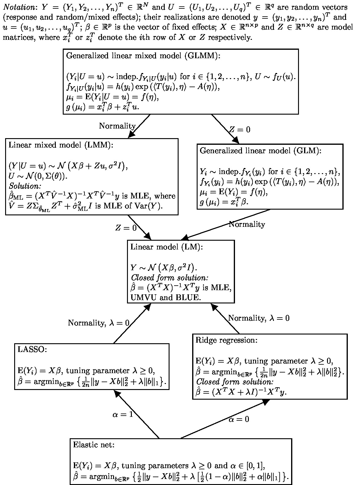

# A flowchart of statistical models



The flowchart is done in LuaLaTeX with the *tikz* package. I want to extend it further. 
:point_right: Any contributions, suggestions and criticism are very welcome. :tada:

Compilation and generation of the JPG image:

```
lualatex flowchart.tex
pdftops -eps flowchart.pdf
convert -density 200 flowchart.eps flowchart.jpg
```
